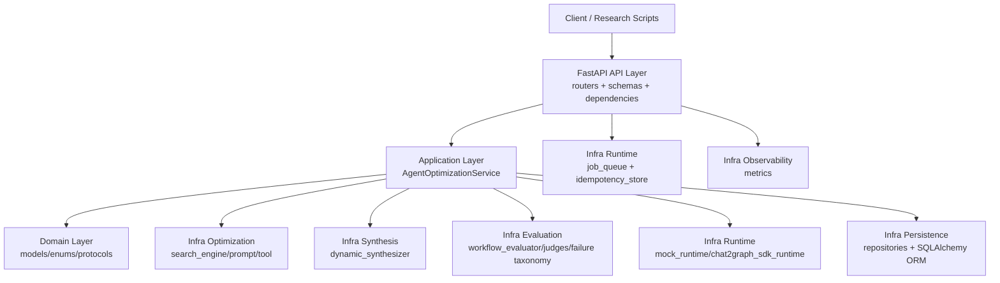
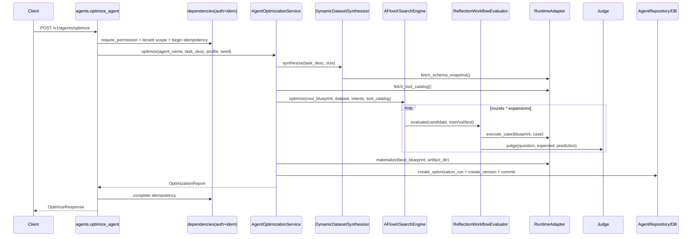
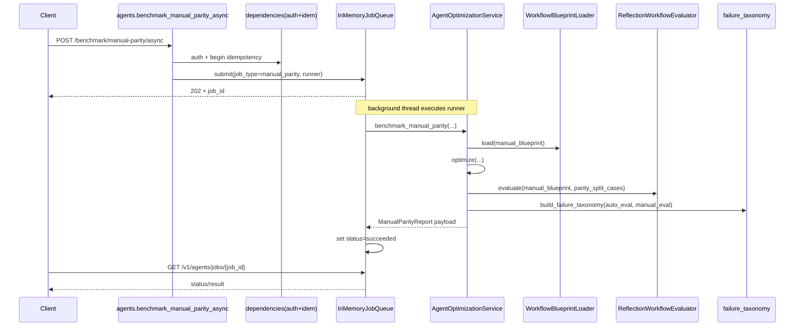
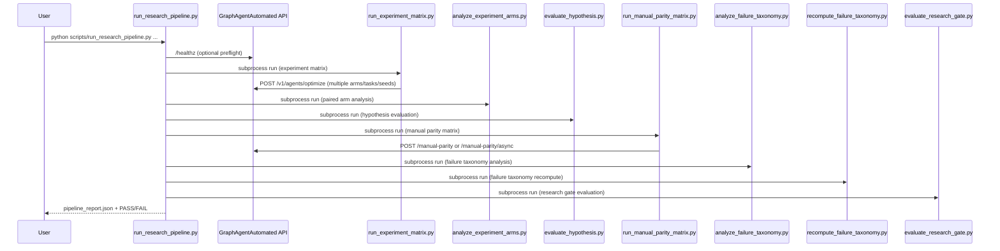

# GraphAgentAutomated 系统完整介绍（Research 版）

最后更新：2026-02-07  
适用范围：当前 `GraphAgentAutomated` 仓库主干代码。

## 0. 目标与边界

这份文档解决四件事：

1. 怎么启动系统（本地 mock / 真实 SDK runtime）。
2. 系统架构、设计思想、代码组织是什么。
3. 每个核心模块的详细设计与职责边界。
4. 核心链路的完整时序图/流程图与函数调用链。

说明：当前项目是 **research-first** 原型，不是“已生产化”系统。

## 1. 启动指南

## 1.1 依赖前提

1. Python `>=3.10,<3.12`。
2. 使用 `uv` 管理环境（推荐）。
3. 如果要跑真实 runtime：本机需要可访问外部 `chat2graph` 仓库路径。

## 1.2 本地最小启动（mock runtime，推荐先跑通）

```bash
uv sync --all-extras
cp .env.example .env
uv run alembic upgrade head
uv run uvicorn graph_agent_automated.main:app --host 0.0.0.0 --port 8008 --reload
```

健康检查：

```bash
curl http://127.0.0.1:8008/healthz
```

最小 API 验证：

```bash
curl -X POST http://127.0.0.1:8008/v1/agents/optimize \
  -H 'Content-Type: application/json' \
  -d '{
    "agent_name": "demo-agent",
    "task_desc": "Find risky transfer chains and explain evidence",
    "dataset_size": 12,
    "profile": "full_system",
    "seed": 7
  }'
```

## 1.3 真实 SDK runtime 启动（非 mock）

在 `.env` 至少配置：

```bash
CHAT2GRAPH_RUNTIME_MODE=sdk
CHAT2GRAPH_ROOT=/abs/path/to/chat2graph
CHAT2GRAPH_SCHEMA_FILE=/abs/path/to/schema.json   # 可选
SDK_RUNTIME_TIMEOUT_SECONDS=30
SDK_RUNTIME_MAX_RETRIES=2
```

然后同样执行：

```bash
uv run alembic upgrade head
uv run uvicorn graph_agent_automated.main:app --host 0.0.0.0 --port 8008 --reload
```

说明：

1. `sdk` 模式下会调用外部 `chat2graph` 的 `AgenticService`。
2. 如果 `CHAT2GRAPH_ROOT` 无效或缺少 SDK 入口文件，会直接启动失败。
3. runtime 适配器含 timeout/retry/circuit-breaker。

## 1.4 Judge 后端切换

1. `JUDGE_BACKEND=mock`：本地规则/启发式 judge（默认）。
2. `JUDGE_BACKEND=openai`：启用 OpenAI judge，需要 `OPENAI_API_KEY`。

## 1.5 鉴权与多租户

默认 `AUTH_ENABLED=false`。若开启鉴权：

```bash
AUTH_ENABLED=true
AUTH_API_KEYS_JSON={"tenant-a-key":{"tenant_id":"tenant-a","role":"admin"}}
# 或 JWT:
AUTH_JWT_KEYS_JSON={"kid-2026-02":"your-secret"}
```

请求时使用：

1. `X-API-Key: <key>` 或
2. `Authorization: Bearer <jwt>`

写请求支持 `Idempotency-Key`（重试去重）。

## 1.6 研究实验入口

建议优先用脚本跑批评测：

1. `scripts/run_experiment_matrix.py`：baseline/ablation/idea arms。
2. `scripts/run_manual_parity_matrix.py`：自动方案 vs 人工蓝图 parity。
3. `scripts/run_research_pipeline.py`：一键串联矩阵、对照、parity、failure、gate。

## 2. 系统架构与代码组织

## 2.1 分层架构



## 2.2 目录组织（核心）

```text
src/graph_agent_automated/
  main.py                         # FastAPI app + middleware + router 装配
  core/
    config.py                     # 统一环境变量配置
    database.py                   # SQLAlchemy engine/session/base
  api/
    schemas.py                    # 请求响应模型
    dependencies.py               # auth/rbac/tenant/idempotency 依赖
    routers/
      agents.py                   # optimize/parity/versions/jobs API
      health.py                   # /healthz /metrics
  application/
    services.py                   # 核心编排服务（优化/对标）
    profiles.py                   # profile -> knobs 映射
  domain/
    enums.py                      # profile/topology/intent 等枚举
    models.py                     # Blueprint、Dataset、Evaluation 等数据模型
    protocols.py                  # Runtime/Judge/Selector 等抽象协议
  infrastructure/
    synthesis/                    # 动态数据合成
    optimization/                 # AFlowX 搜索、prompt 变异、tool 选择
    evaluation/                   # evaluator、judge、failure taxonomy、统计
    runtime/                      # mock/sdk runtime、yaml、loader、async client
    persistence/                  # ORM + repository
    observability/                # metrics registry
scripts/
  run_experiment_matrix.py
  run_manual_parity_matrix.py
  run_research_pipeline.py
```

## 3. 模块详细设计

## 3.1 API 层（`api/routers/agents.py`）

主要端点：

1. `POST /v1/agents/optimize`
2. `POST /v1/agents/optimize/async`
3. `POST /v1/agents/benchmark/manual-parity`
4. `POST /v1/agents/benchmark/manual-parity/async`
5. `GET /v1/agents/jobs/{job_id}`
6. `GET /v1/agents/{agent_name}/versions`
7. `POST /v1/agents/{agent_name}/versions/{version}/deploy|rollback`

关键设计点：

1. 鉴权通过 `require_permission()` 强制 RBAC。
2. agent 名称经 `tenant_id::agent_name` 做租户隔离。
3. 写请求支持幂等（in-memory store）。
4. async 接口提交到 in-process job queue，轮询查询状态。

## 3.2 鉴权与租户隔离（`api/dependencies.py`）

认证路径：

1. `AUTH_ENABLED=false`：默认给本地 `admin` 上下文。
2. `AUTH_ENABLED=true`：优先 JWT；否则检查 API key。

JWT 支持：

1. `HS256` 签名校验。
2. `kid` 多 key 轮换。
3. `exp/nbf/iat/iss/aud` 校验。

RBAC 权限集合：

1. `viewer`: `versions:read`
2. `operator`: `versions:read`, `optimize:run`, `parity:run`
3. `admin`: 增加 `versions:deploy`, `versions:rollback`

## 3.3 应用编排服务（`application/services.py`）

`AgentOptimizationService` 是系统主编排器，含两个核心入口：

1. `optimize(...)`
2. `benchmark_manual_parity(...)`

`optimize` 内部步骤：

1. 解析 profile 成 knobs（`resolve_optimization_knobs`）。
2. 选择 runtime（mock 或 sdk）。
3. 构建 judge（ensemble 或 single）。
4. 动态合成数据集（train/val/test 切分）。
5. 推断任务 intent，选择初始工具集合。
6. 构建初始 workflow blueprint。
7. 调用 AFlowX 搜索优化（prompt/tool/topology 联合）。
8. 渲染产物 `workflow.yml` + 写 artifact 报告。
9. 入库：optimization run + round traces + version。

`benchmark_manual_parity` 内部步骤：

1. 校验并加载人工蓝图（YAML/JSON）。
2. 先跑一轮 `optimize` 得到自动蓝图。
3. 在同一 split（优先 test）上分别评估 auto/manual。
4. 计算 `score_delta`、`parity_achieved`。
5. 构建 failure taxonomy（类别 + 严重度 + case items）。
6. 写出 parity 报告 artifact。

## 3.4 Profile 与算法开关（`application/profiles.py`）

`ExperimentProfile -> OptimizationKnobs` 控制：

1. 是否动态数据集、hard negatives、paraphrase。
2. 是否 ensemble judge。
3. 搜索时允许 prompt/tool/topology 哪些变异。
4. 是否启用 holdout（val/test）与 generalization penalty。
5. 是否启用 failure-aware mutation（idea arm）。

## 3.5 搜索引擎（`infrastructure/optimization/search_engine.py`）

`AFlowXSearchEngine` 是 MCTS 风格搜索，核心机制：

1. 选择：UCB + novelty bonus。
2. 扩展：prompt/tool/topology 三类变异。
3. 评估：train（必要）+ val/test（holdout 打开时）。
4. 反向传播：沿父链更新 visits/value。
5. 早停：`min_improvement + patience`。

目标函数（简化）：

```text
objective = mean_score
          + confidence_weight * confidence
          - latency_penalty * latency
          - cost_penalty * token_cost
          - complexity_penalty * complexity
          - uncertainty_penalty * uncertainty
```

模型选择目标（holdout）：

```text
model_selection = val_objective - generalization_penalty * (train_score - val_score)_+
```

failure-aware mutation：

1. 先根据失败样本规则分类（tool/decomposition/execution/verifier）。
2. 按类别提升对应 mutation 模式权重。
3. 选权重最高模式进行本轮扩展。

## 3.6 数据合成（`infrastructure/synthesis/dynamic_synthesizer.py`）

核心逻辑：

1. 读取 runtime schema（labels/relations）。
2. 从 task_desc 推断 intents。
3. 用 intent 模板渲染问题并可做 paraphrase。
4. 可插入 hard negatives（“无法推断”场景）。
5. 按 ratio 切分 train/val/test 并写 synthesis report。

## 3.7 评估与 Judge（`infrastructure/evaluation/*`）

`ReflectionWorkflowEvaluator`：

1. 对每个 case 执行 runtime。
2. 调用 judge 打分（score + rationale）。
3. 收集 vote/agreement/confidence（ensemble 时）。
4. 聚合 `EvaluationSummary`（mean、std、latency、token_cost、reflection）。

Judge 类型：

1. `RuleBasedJudge`：规则一致性。
2. `HeuristicJudge`：词重叠启发式。
3. `OpenAIJudge`：LLM-as-a-judge。
4. `EnsembleJudge`：多 judge 加权汇总 + agreement/confidence。

## 3.8 Failure Taxonomy（`infrastructure/evaluation/failure_taxonomy.py`）

分类：

1. `tool_selection`
2. `decomposition`
3. `execution_grounding`
4. `verifier_mismatch`
5. `other`

严重度：`mild/moderate/severe`，按 manual-auto 分差阈值判定。  
规则可外置 JSON（版本化）并离线重算。

## 3.9 Runtime 抽象（`domain/protocols.py` + `infrastructure/runtime/*`）

`RuntimeAdapter` 统一四个能力：

1. `fetch_schema_snapshot`
2. `fetch_tool_catalog`
3. `execute_case`
4. `materialize`

实现：

1. `MockRuntimeAdapter`：确定性、可复现、本地快。
2. `Chat2GraphSDKRuntimeAdapter`：接外部 chat2graph，带 timeout/retry/circuit。

## 3.10 持久化（`infrastructure/persistence/*`）

数据库实体：

1. `agents`
2. `agent_versions`
3. `evaluation_cases`
4. `optimization_runs`
5. `optimization_round_traces`

Repository 提供：

1. agent/version/run 创建。
2. 版本列表、部署、回滚。
3. round trace 持久化。

## 3.11 异步任务与幂等（`runtime/job_queue.py`, `runtime/idempotency_store.py`）

当前实现是内存版：

1. `InMemoryJobQueue`：线程池执行作业，状态 `queued/running/succeeded/failed`。
2. `InMemoryIdempotencyStore`：幂等开始/完成/丢弃。

注意：进程重启会丢失状态（research 阶段可接受）。

## 3.12 可观测性（`main.py`, `observability/metrics.py`）

1. HTTP middleware 记录请求耗时、状态码。
2. `/metrics` 暴露请求与异步作业统计。
3. 请求日志为 JSON 行格式。

## 4. 核心链路时序图与函数调用链

## 4.1 `POST /v1/agents/optimize`（同步）



函数调用链（主干）：

```text
api.routers.agents.optimize_agent
  -> application.services.AgentOptimizationService.optimize
    -> application.profiles.resolve_optimization_knobs
    -> infrastructure.synthesis.dynamic_synthesizer.DynamicDatasetSynthesizer.synthesize
    -> infrastructure.optimization.search_engine.infer_intents
    -> infrastructure.optimization.tool_selector.IntentAwareToolSelector.rank
    -> infrastructure.optimization.search_engine.build_initial_blueprint
    -> infrastructure.optimization.search_engine.AFlowXSearchEngine.optimize
      -> infrastructure.evaluation.workflow_evaluator.ReflectionWorkflowEvaluator.evaluate
        -> runtime.execute_case
        -> judge.judge
    -> runtime.materialize
    -> infrastructure.persistence.repositories.AgentRepository.create_optimization_run
    -> infrastructure.persistence.repositories.AgentRepository.create_version
```

## 4.2 `POST /v1/agents/benchmark/manual-parity/async` + `GET /jobs/{id}`



函数调用链（主干）：

```text
api.routers.agents.benchmark_manual_parity_async
  -> runtime.job_queue.InMemoryJobQueue.submit
    -> runner()
      -> application.services.AgentOptimizationService.benchmark_manual_parity
        -> runtime.workflow_loader.WorkflowBlueprintLoader.load
        -> application.services.AgentOptimizationService.optimize
        -> infrastructure.evaluation.workflow_evaluator.ReflectionWorkflowEvaluator.evaluate
        -> infrastructure.evaluation.failure_taxonomy.build_failure_taxonomy
```

## 4.3 `scripts/run_research_pipeline.py` 一键链路



## 5. 关键工件与输出

API optimize 单次运行（示例路径）：

1. `artifacts/agents/<agent_name>/<run_id>/workflow.yml`
2. `artifacts/agents/<agent_name>/<run_id>/dataset_report.json`
3. `artifacts/agents/<agent_name>/<run_id>/round_traces.json`
4. `artifacts/agents/<agent_name>/<run_id>/prompt_variants.json`
5. `artifacts/agents/<agent_name>/<run_id>/run_summary.json`

manual parity 额外输出：

1. `manual_parity_report.json`
2. `manual_parity_case_report.json`

脚本批量输出（时间戳目录）：

1. `artifacts/experiments/<timestamp>/...`
2. `artifacts/manual_parity/<timestamp>/...`
3. `artifacts/pipeline/pipeline_<timestamp>.json`

## 6. “真实环境”在本项目中的定义

本项目里“真实环境”不是指上线生产，而是指：

1. runtime 使用 `CHAT2GRAPH_RUNTIME_MODE=sdk`（而不是 mock）。
2. judge 至少包含真实 LLM judge（通常 `JUDGE_BACKEND=openai`）。
3. 在冻结 benchmark（`docs/benchmarks/research_benchmark_v1.json`）上多 seed 跑完 parity 与统计。

只有满足上面三点，研究结论才可用于判断“是否达到人工 parity”。

## 7. 扩展建议（从代码入口看）

如果你准备继续做 research 迭代，推荐扩展点：

1. 在 `application/profiles.py` 增加新 idea profile（最小侵入）。
2. 在 `optimization/search_engine.py` 增加 mutation policy/selection policy。
3. 在 `evaluation/failure_taxonomy.py` 升级规则并版本化 JSON。
4. 在 `scripts/run_research_pipeline.py` 把新实验步骤并入一键流水线。

